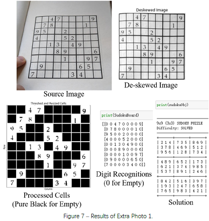

# sudoku-solver

Build a Sudoku recognizer via computer vision and solve it, step by step.

| Step                                     | Notebook                       | Document                            |
| ---------------------------------------- | ------------------------------ | ----------------------------------- |
| Part 1 - Recognize the Frame and De-skew | [Notebook](sudoku_part1.ipynb) | [Document](sudoku_report_part1.pdf) |
| Part 2 - Localize and Identify Cells     | [Notebook](sudoku_part2.ipynb) | [Document](sudoku_report_part2.pdf) |
| Part 3 - Recognize Numbers and Solve     | [Notebook](sudoku_part3.ipynb) | [Document](sudoku_report_part3.pdf) |

